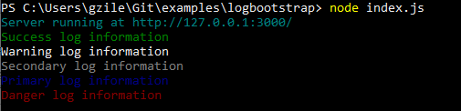

# LOG BOOTSTRAP
useful colorful log messages

## Install

```
    npm install --save logbootstrap
    yarn add logbootstrap
```

## Usage

```
    var log = require('logbootstrap);
    log('success', 'message to log');
```

### Colors

- 'success': green
- 'warning': yellow
- 'info': cyan
- 'secondary': gray
- 'primary': blue
- 'danger': red

## Examples
### Create Hello World nodejs application
```
$ mkdir ~/helloworld
$ cd ~/helloword
$ npm init
$ npm install logbootstrap
$ nano index.js
```
### index.js
```
const http = require('http');
const log = require('logbootstrap);

const hostname = '127.0.0.1';
const port = 3000;

const server = http.createServer((req, res) => {
  res.statusCode = 200;
  res.setHeader('Content-Type', 'text/plain');
  res.end('Hello, World!\n');
});

server.listen(port, hostname, () => {
  log('info', 'Server running at http://' + hostname + ':' + port + '/');
  log('success', 'Success log information');
  log('warning', 'Warning log information');
  log('secondary', 'Secondary log information');
  log('primary', 'Primary log information');
  log('danger', 'Danger log information');
});
```
### Run nodejs application
```
node index.js
```



[](https://dev.to/gzileni =90x)
